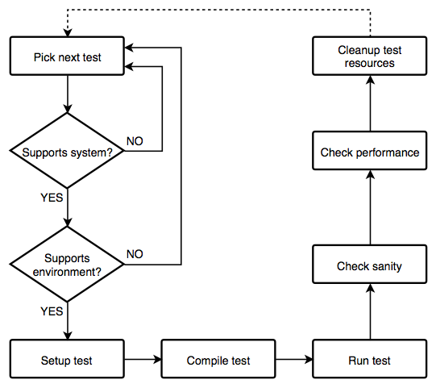

<!-- # Regression Check Pipeline

The backbone of the ReFrame regression framework is the pipeline of the regression check.
This is a set of well defined phases that each regression test goes through during its lifetime.
The figure below depicts this pipeline in detail.

 -->

# Motivation

An overwhelming majority of time in molecular dynamics simulations is spent in calculation of forces due to non-bonded interactions on particles. Often these are computed by a method that is well understood, and for which a high-quality high-performance implementation exists, such as found in GROMACS. However many kinds of innovation would like to build on such implementations without needing to grapple with extending a large and complex code base.

# Potential Benefits

The benefits extend in two ways in various aspects of MD Simulations for both developers (power users) and end users who just run the MD program:

+ Enable easy development through the API thanks to clear separation which reduces the Ideation-to-Implementation time. This will help increase the capabilities of Molecular dynamics codes.
+ Enable widespread use of already developed codes on a modular basis. This may enable users from other domains of science to also adopt general particle-dynamics based simulations through the API.

This undertaking specifically targets the following user requirements in extensibility.

# New Long Range Calculation Methods

The current state of the art in long range calculations includes variations of Particle Mesh Ewald (PME) based approaches. The new supercomputing architectures exhibit several thousand nodes with CPUs and accelerators in the same compute nodes. Current approaches encounter bottlenecks with scalability as communication overhead becomes dominant very quickly with more nodes participating in the simulation.

Proposals of ‘exascale friendly’ methods that scale linearly with compute resources include approaches like Fast Multipole Method (FMM) and Multigrid. Integration of these new methods into established software packages with a robust MD simulation pipeline is essential. The vision is to provide a modular API for non-bonded calculations that clearly separates this compute-time intensive part of the code with the rest.

# Integration of New Force Fields

In addition to the commonly used van der Waals’ forces and electrostatic interactions, there are cases where a simulation might require other types of forces (like metal potentials commonly used in material science simulations). Other examples include Cryo-EM simulations where a large molecule is folded to conform to electron microscope observations of the density maps. In these cases, forces are created dynamically based on the difference from the experimental density of the density estimated from the state of the simulation molecule.

A modular software library empowers rapid prototyping of new approaches in different stages of the MD simulation pipeline while offering the benefits of the rest. This permits testing and experimentation on problem sizes that approach full scale for moderate investment in code development.

# New Parallelization Paradigms

Most simulation packages including GROMACS rely on MPI based communication to distribute compute efforts across a cluster. This primarily uses data-parallelism where the same calculations are performed on different sub-domains. New approaches based on task-based parallelism, like HPX, Argobots, QuickSched and TBB, show some promising benefits including reduction of idle/waiting time, lower communication overheads, among others. Experiments are proposed the combine these approaches in novel ways.

Tightly coupled code bases would have a hard time migrating between different parallelization paradigms. A modular package which fully separates the compute algorithm from the parallelization strategy would enable rapid development of new features, either of compute or for parallelization.

# Using different backends for custom MD codes

Enabling developers of custom MD programs to call the high-performance compute engine of GROMACS would be among the primary objectives of this undertaking. By ‘librarizing’ the non-bonded calculations into an easily deployable API, users of custom codes can offload components of the simulation pipeline from/to GROMACS. At a second step, other functionalities present on different mainstream molecular dynamics codes, such as Amber, NAMD and LAMMPS would be incorporated.

For instance, a user may have a custom prototype for a simulation where specific bonded interactions, integration methods, statistical calculations are already implemented. However, the user seeks a high performance engine to provide the forces, virial and energy corresponding to each molecule of the system. Such a user should be able to benefit with minimal modifications to his original code.

<!-- This would increase the userbase of high performant molecular dynamics codes, who primarily consist of those using it as a stand-alone program providing the whole MD pipeline. Modularization would enable use of specific components of GROMACS, namely the non-bonded interactions in more projects in the research community, across several disciplines.
 -->
# Key Challenges

Alternative software infrastructure meets some of these needs, and we should consider what tool kits such as LAMMPS, OpenMM, PLUMED, and SimTK can already do. There are lessons to learn, and functionality to avoid duplicating unless there is a need to do so.

Integrating code into high performant molecular dynamic engines have very high standards for portability, code maintainability. For example, every change
+ Will go through at least two reviewers,
+ Must pass Jenkins CI on a wide variety of HPC-relevant compilers, libraries, OS,
+ Should support a wide range of kinds of parallelism,
+ Must conform to coding style (including the linting implemented in Jenkins),
+ Must have Doxygen comments
+ Must have suitable test coverage,
+ Should not lead to performance regressions resulting from e.g. excessive use of OO approaches, or dynamic dispatch.
+ Each git commit proposed for code review should address a single logical change, and clearly separate minor code cleanup, from strategic refactoring, from adding or removing new functionality.
+ Time of code reviewers is normally the limiting resource, and it is further expected that developers on all projects contribute actively to reviewing the changes from others, where their expertise permits. Doing this review helps contributes to education as an HPC developer.

# Proposal

## Stage 1

Refactor existing behaviour of GROMACS so that its library can expose functionality that supports user code that resembles the Python pseudo-code (for a very simple case of Argon atoms with no bonded interactions).


```python
import nblibrary

argon_simulation = read_from_file("argon.tpr")

register_simulation(argon_simulation)

while (argon_simulation.should_continue()):
    [energies, forces, virial] = calculate_forces(argon_simulation.state)
    argon_simulation.state.update(forces, virial)
```

Although the work of providing Python bindings is something that should be done later, in collaboration with existing efforts to support python bindings.

Simple use cases demonstrating that the API has current and potential value will be developed, including the above kinds of argon simulation, along with some simple examples of higher-order simulations, such as replica exchange.

## Stage 2

Provide C++11 bindings for the API that supports users writing code like the above,

## Stage 3

Develop a lower-level API that exposes aspects of domain decomposition, pair search, and force providers to customization or extension by users, in response to perceived / surveyed needs of potential users of the library. It is envisaged that most users should be satisfied with the high-level API, but this needs investigation.

